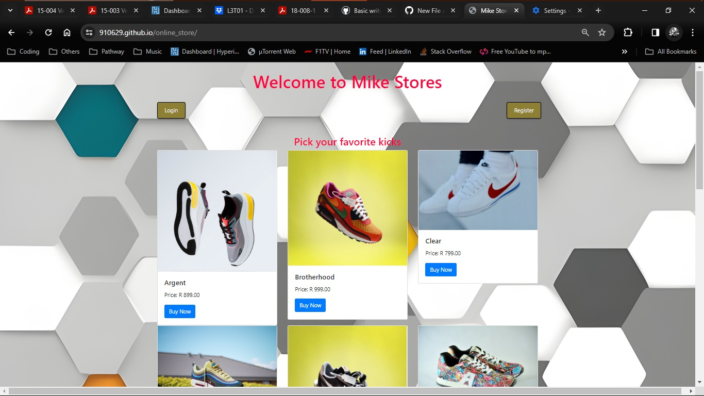

# Mike Store - Online Shop

Welcome to Mike Stores, your go-to online shop for the latest and trendiest kicks. This simple web page showcases a collection of stylish shoes that users can explore and purchase. The design incorporates a clean layout with Bootstrap styling and a vibrant background to enhance the visual appeal.

## Getting Started

These instructions will help you set up and view the online shop locally on your machine.

### Prerequisites

- Web browser
- Code editor (optional)

### Installation

1. Clone the repository to your local machine by typing into your terminal/command prompt:
   >git clone https://github.com/your-username/mike-store.git
2. Open the 'index.html' file in your web browser.

## Features

- **Login and Registration Buttons:** Easily access login and registration options for a personalized shopping experience (not yet functional.

- **Product Showcase:** Explore a variety of kicks with images, names, prices, and a "Buy Now" button (not yet functional).

- **Footer Form:** Stay updated by submitting your name, email, and mobile number through the form in the footer (not yet functional).

## Preview

## Built With

- HTML
- CSS
- [Bootstrap](https://getbootstrap.com/) - Front-end framework

## Authors

- **Jarache Khunyeli** - [GitHub Profile](https://github.com/910629)

## License

This project is currently unlicensed.

Repository Link: [Online_Store](https://github.com/910629/online_store)

## Acknowledgments

- [Bootstrap](https://getbootstrap.com/) - Front-end framework used.
- Images used in this project are for demonstration purposes only.
